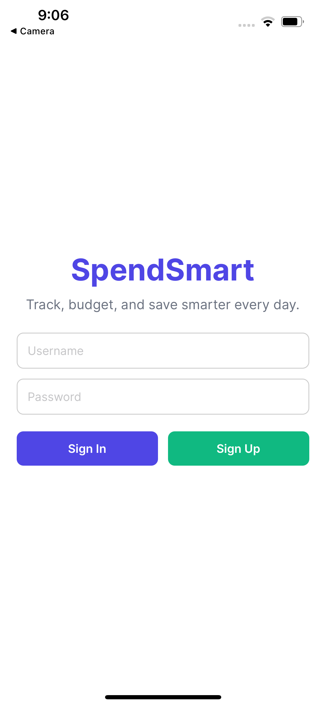

# SpendSmart - Your Proactive Spending Awareness Tool

SpendSmart is a Chrome extension designed to help you understand your spending habits *before* the month ends. By visualizing your financial data directly within your browser, we empower you to make smarter financial decisions and avoid overspending.

## Inspiration

Inspired by the surprise many feel when reviewing monthly expenses, SpendSmart aims to provide proactive awareness of spending patterns, enabling users to take control of their finances.

## What it does

* **Spending Summary Dashboard:** Provides a clear visual overview of your total monthly spending.
* **Categorized Breakdown:** Shows where your money is going with an intuitive pie chart (as seen in the screenshot).
* **Spending Pace Tracking:** Visualizes your spending trend over time to help you stay on track.
* **(Future Vision):** Location-based mobile alerts to warn against overspending at specific locations.
* **(Future Vision):** AI-powered personalized insights and spending recommendations.

## How it's Built

* **Chrome Extension:** Developed using React for the user interface and styled with CSS.
* **Data Source:** Leverages the **Nessie API, Capital One's Hackathon API**, to generate realistic banking data for demonstration.
* **Data Fetching:** Utilizes Chrome's runtime messaging API for secure communication with the backend (Nessie).
* **(Future):** Mobile application envisioned using React Native or Flutter with location services.

## Screenshots

### Chrome Extension
 

### Mobile App
     

## Challenges We Faced

* Ensuring secure handling of user identifiers.
* Initially considering and then pivoting from GET requests to more secure POST requests for data retrieval.
* Understanding the data model of the Nessie API.

## Accomplishments We're Proud Of

* Building a functional Chrome extension showcasing real-world spending data visualization.
* Implementing a secure authentication flow using POST requests.
* Creating an intuitive dashboard with clear spending breakdowns and pace tracking.

## What We Learned

* Developing Chrome extensions and utilizing Chrome's API.
* Working with the Nessie API and understanding real-world banking data structures.
* Prioritizing user security in API interactions.
* Collaborative development using Git and GitHub.

## What's Next

* Integrating AI for personalized spending insights.
* Developing a mobile application with location-based spending alerts.
* Refining the user interface and adding more detailed analytics.
* Exploring integration with actual financial APIs (with user authorization).

## Team

* Lianyu Peng
* Brian Xie
* Jonathan Lee
